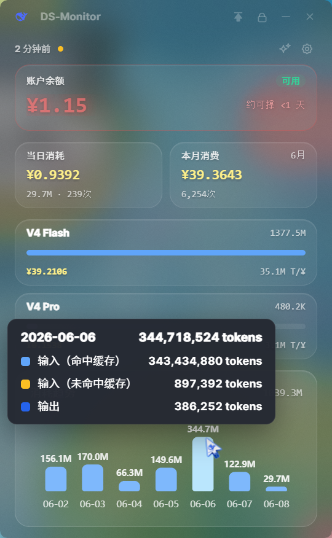

<p align="right">
  <a href="./README.md">简体中文</a> · <strong>English</strong>
</p>

<div align="center">

# DS-Monitor

**A lightweight, transparent desktop monitor for DeepSeek API usage**

Real-time balance · Token usage · Cost trends · Platform sync · AI insights

<br />

[](https://github.com/milusvip/DS-Monitor)
[](./LICENSE)
[](https://github.com/milusvip/DS-Monitor)
[](https://tauri.app/)
[](https://react.dev/)

<br />

> **Disclaimer:** This is an independent open-source project. It is not affiliated with, endorsed by, or maintained by DeepSeek. You use this software at your own risk regarding API usage and account security.

<br />


</div>

<br />

## Contents

- [Features](#features)
- [Screenshots](#screenshots)
- [Quick Start](#quick-start)
- [Usage](#usage)
- [Development](#development)
- [Privacy](#privacy)
- [Contributing](#contributing)
- [Support the Author](#support-the-author-optional)

---

## Features

| Module | Description |
| :--- | :--- |
| **Balance** | Live API balance, availability status, low-balance alert with breathing glow, estimated days remaining |
| **Usage** | Daily & monthly spend, per-model bars, 7-day cost trend chart (hover for details) |
| **Platform sync** | Sign in to DeepSeek platform once; usage syncs silently in the background |
| **AI analysis** | Cache hit rate, input token breakdown, 7-day trends, AI-generated usage report |
| **Desktop UX** | Frameless acrylic UI, system tray, always-on-top, interaction lock, custom cursor |
| **Settings** | API Key, refresh interval, launch at startup, Chinese/English UI, clear all local data |

---

## Screenshots

### Main dashboard

Your daily overview: balance, spend, model usage, and trends in one place.

<p align="center">
  
</p>

Hover over a bar in the **usage trend** chart at the bottom to see token breakdown and cost for that day.

<p align="center">
  
</p>

---

### Settings

Open from the ⚙️ icon in the top-right. Manage API Key, platform login, refresh interval, auto-start, language, and GitHub repo link.

<p align="center">
  
</p>

---

### AI analysis

Open from the ✨ icon. The window expands to the right with hit rates, charts, and usage summary.

<table align="center">
  <tr>
    <td align="center" width="50%">
      
      <br /><sub>Charts & metrics</sub>
    </td>
    <td align="center" width="50%">
      
      <br /><sub>AI usage report (click refresh to generate)</sub>
    </td>
  </tr>
</table>

---

## Quick Start

### Requirements

- Windows 10 / 11
- [Node.js](https://nodejs.org/) 18+
- [pnpm](https://pnpm.io/)
- [Rust](https://www.rust-lang.org/tools/install) (for Tauri builds)

### Install & run

```bash
git clone https://github.com/milusvip/DS-Monitor.git
cd DS-Monitor
pnpm install
pnpm tauri dev
```

### Build installer

```bash
pnpm tauri build
```

Output: `src-tauri/target/release/bundle/`

---

## Usage

```
① Set API Key  →  ② Verify  →  ③ Platform login (optional)  →  ④ View dashboard
```

1. **Configure API Key**  
   Click ⚙️ Settings, enter your DeepSeek API Key, and verify.

2. **Platform login (recommended)**  
   Detailed usage requires a platform session. Sign in when prompted and open the usage page; sync continues in the background.

3. **Daily use**  
   - Dashboard: balance, daily/monthly spend, model usage, trend chart (hover bars for details)  
   - AI analysis: hit rate, cache breakdown, AI report  
   - Tray: close the window to keep running in the system tray; double-click or right-click to restore

4. **Shortcuts**  
   - Title bar: pin 📌, lock 🔒, minimize, close to tray  
   - Right-click menu: refresh, analysis, settings, hide to tray  
   - Settings: refresh interval, auto-start, language

---

## Development

```bash
# Frontend only
pnpm dev

# Full desktop app
pnpm tauri dev

# Typecheck + frontend build
pnpm build
```

**Stack:** Tauri 2 · React 19 · TypeScript · Tailwind CSS 4 · Zustand · ECharts

---

## Privacy

- API Key is encrypted and stored locally on your machine
- No Key or account data is sent to third-party servers
- AI reports are generated via your API Key through the DeepSeek API
- "Clear all data" removes local Key, session, and cache in one step

---

## Contributing

Repository: **[github.com/milusvip/DS-Monitor](https://github.com/milusvip/DS-Monitor)**

Stars ⭐, Issues, and Pull Requests are welcome.

---

## Support the Author (optional)

If DS-Monitor helps you, voluntary tips are appreciated.  
**The app works fully without tipping.**

<p align="center">

| WeChat Pay | Alipay |
| :---: | :---: |
|  |  |

</p>

---

## License

[MIT License](./LICENSE)
