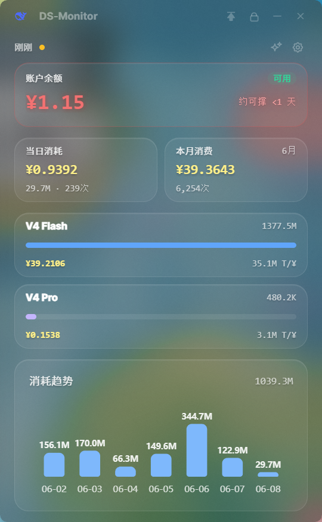
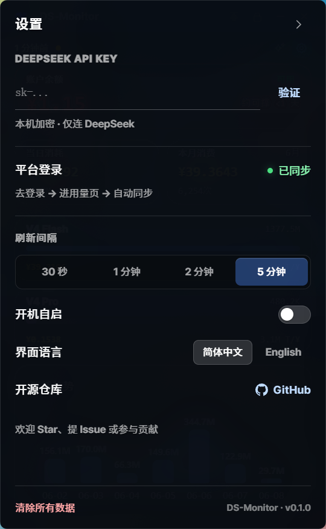
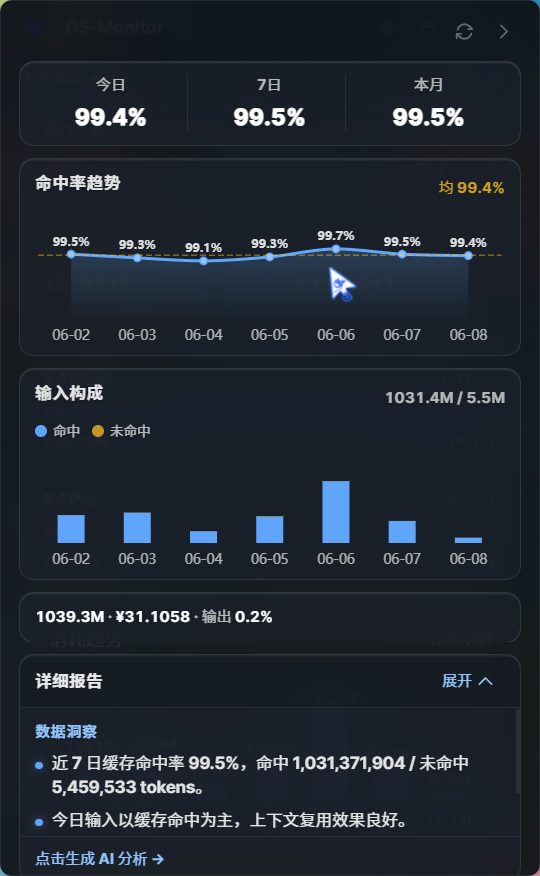
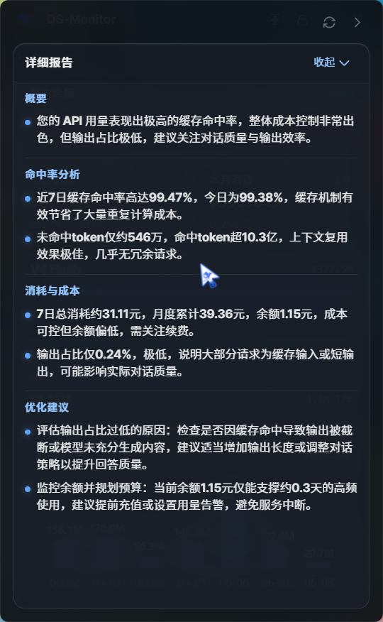
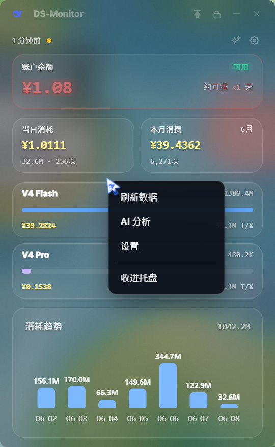

<p align="center">
  <strong>简体中文</strong> · <a href="README.en.md">English</a>
</p>

<div align="center">

# OC-Monitor

**轻量、透明的 OpenCode / Claude Code 用量桌面监控工具**

两路数据源 · 多 provider 一键切换 · 实时趋势 · AI 智能分析

<br />

[](https://github.com/Apeacefullife/oc-monitor)
[](./LICENSE)
[](https://github.com/Apeacefullife/oc-monitor)
[](https://tauri.app/)
[](https://react.dev/)

<br />

Windows 轻量级桌面监控工具，常驻系统托盘。  
同时读 `~/.claude/projects/`（Claude Code 本地日志）和 `~/.cc-switch/cc-switch.db`（CCSwitch 代理记录），**设置里一键切"数据来源"**——OpenCode 模式、Claude Code 模式（包括直接调 DeepSeek / OpenCode Go 等第三方 endpoint）**瞬时切换**，不重新读盘。

</div>

---

> 本项目由 [DS-Monitor](https://github.com/milusvip/DS-Monitor) 改造而来，从监控 DeepSeek API 转向监控本地 OpenCode / Claude Code 的真实调用数据。

---

## 适用场景

| 你怎么用 AI 工具 | OC-Monitor 能看到啥 |
| :--- | :--- |
| OpenCode CLI + CCSwitch 代理 | 切到 **OpenCode** 模式，CCSwitch 里 `_opencode_session` 的全部用量 |
| Claude Code CLI 直连 Anthropic | 切到 **Claude Code** 模式，自动从 `~/.claude/projects/` 读 JSONL |
| Claude Code CLI + `ANTHROPIC_BASE_URL` 指向 DeepSeek / OpenCode Go 等 | 切到 **Claude Code** 模式，JSONL 里 `model=deepseek-chat` 等记录**全部能监测**（定价表已内置） |
| OpenCode + Claude Code 混用 | 切换数据来源，对比两边用量 |

> 💡 两路数据**天然不重复**：CCSwitch 记录标 `_opencode_session`，JSONL 记录标 `_claude_log`，互不干扰。

---

## 功能亮点

| 模块 | 说明 |
| :--- | :--- |
| **双数据源** | 后端并拉 CCSwitch SQLite + Claude Code JSONL，前端按 dataSource 选项过滤展示 |
| **数据源切换** | 设置里 OpenCode / Claude Code 二选一，**纯前端 useMemo 重算**，瞬时无延迟 |
| **Token 统计** | Input / Cache-Read / Cache-Creation / Output 全拆分，分模型占比 |
| **消费趋势** | 当日消耗、本月消费、近 7 日趋势柱状图，悬停查看每根柱子明细 |
| **缓存命中** | 自动算 cache hit rate，提示 prompt 结构是否稳定 |
| **AI 分析** | 命中率趋势、Token 构成、7 日曲线，**一键 AI 用量报告**（走你自己的 API Key） |
| **模型筛选** | 设置里勾选要在主面板显示的模型，至少保留一个 |
| **桌面体验** | 无边框毛玻璃、系统托盘、窗口置顶、锁定防误触、自定义光标 |
| **本地隐私** | **完全离线**运行，所有数据在本机解析，**不向任何外部服务器上传** |
| **个性设置** | 数据源、刷新间隔、模型筛选、开机自启、中英文、一键清除本地数据 |

---

## 它读取什么数据？

OC-Monitor **完全在本地**解析你的 OpenCode / Claude Code 用量，不修改任何源文件。后端**两路并拉**、合并后给前端，前端按设置里的"数据来源"切显示。

| 来源 | 路径 | 包含什么 | 适用"数据来源" |
| :--- | :--- | :--- | :--- |
| CCSwitch SQLite | `~/.cc-switch/cc-switch.db` | `proxy_request_logs` 表的**全部**记录（含所有 provider_id） | **OpenCode** —— 只看 `provider_id = "_opencode_session"` 的部分 |
| Claude Code JSONL | `~/.claude/projects/**/*.jsonl` | `type=assistant` + `message.role=assistant` + `message.usage`（input / cache_read / cache_creation / output tokens、模型、时间戳），后端标记为 `provider_id = "_claude_log"` | **Claude Code** —— 覆盖**直接用 Claude Code CLI 调任意 endpoint**（DeepSeek / OpenCode Go / Anthropic）的用量 |

读取过程只读不改，断网环境下同样工作。

设置里切换"数据来源"是**纯前端操作**（瞬时），不重新读盘也不重新 invoke 后端。

---

## 界面预览

<p align="center">
<table>
<tr><td align="center">
<table border="1" cellpadding="16" cellspacing="0">
<tr>
<td align="center" valign="top" width="50%">
<b>主面板</b><br />
<sub>用量 · 模型 · 趋势</sub><br /><br />

</td>
<td align="center" valign="top" width="50%">
<b>趋势悬浮</b><br />
<sub>悬停柱子查看 Token 明细</sub><br /><br />

</td>
</tr>
<tr>
<td align="center" valign="top" width="50%">
<b>设置</b><br />
<sub>刷新间隔 · 开机自启 · 语言</sub><br /><br />

</td>
<td align="center" valign="top" width="50%">
<b>AI 分析</b><br />
<sub>命中率 · 缓存构成 · 趋势图</sub><br /><br />

</td>
</tr>
<tr>
<td align="center" valign="top" width="50%">
<b>AI 报告</b><br />
<sub>一键生成用量解读</sub><br /><br />

</td>
<td align="center" valign="top" width="50%">
<b>右键菜单</b><br />
<sub>刷新 · 分析 · 设置 · 托盘</sub><br /><br />

</td>
</tr>
</table>
</td></tr>
</table>
</p>

---

## 快速开始

### 环境要求

- Windows 10 / 11
- [Node.js](https://nodejs.org/) 18+
- [pnpm](https://pnpm.io/)
- [Rust](https://www.rust-lang.org/tools/install)（Tauri 构建）
- 本机已安装并使用过 [Claude Code](https://docs.anthropic.com/en/docs/claude-code) 或 [OpenCode](https://opencode.ai/)

### 安装依赖并运行

```bash
git clone https://github.com/Apeacefullife/oc-monitor.git
cd oc-monitor
pnpm install
pnpm tauri dev
```

### 打包发布

```bash
pnpm tauri build
```

安装包输出目录：`src-tauri/target/release/bundle/`

---

## 使用指南

```
① 启动 OC-Monitor  →  ② 自动扫描本地用量  →  ③ 主面板查看  →  ④ 切数据源对比  →  ⑤ 一键 AI 报告
```

1. **首次启动**  
   OC-Monitor 自动扫描 `~/.claude/projects/` 和 `~/.cc-switch/` 下的数据，无需任何账号配置。

2. **数据源切换（核心功能）**  
   - 设置 → 数据来源 → 选 **OpenCode** / **Claude Code**  
   - 主面板数字**瞬时变化**，不重新读盘也不卡顿  
   - **OpenCode 模式**看 CCSwitch 里 `_opencode_session` 记录  
   - **Claude Code 模式**看 `~/.claude/projects/**/*.jsonl`（覆盖 Claude Code CLI 调任何 endpoint）

3. **日常查看**  
   - 主面板：今日 / 本月消费、模型占比、近 7 日趋势（悬停柱子看明细）  
   - AI 分析：缓存命中率、Token 构成、AI 报告  
   - 托盘：关闭窗口后驻留托盘，双击或右键唤回

4. **常用操作**  
   - 标题栏：置顶 📌、锁定 🔒、最小化、关闭到托盘  
   - 右键菜单：刷新、打开分析/设置、隐藏到托盘  
   - 设置：数据源、模型筛选、刷新间隔、开机自启、切换语言

---

## 开发与构建

```bash
# 仅前端
pnpm dev

# 完整桌面应用
pnpm tauri dev

# 类型检查 + 前端构建
pnpm build
```

技术栈：**Tauri 2** · **React 19** · **TypeScript** · **Tailwind CSS 4** · **Zustand** · **ECharts** · **rusqlite**

---

## 隐私说明

- 全部用量数据 **仅在你的本机解析**，不向任何外部服务器上传
- 「清除所有数据」可一键删除本地缓存与会话
- 与 Claude Code / OpenCode 官方无关联，为独立第三方工具

---

## 开源与贡献

仓库地址：**[github.com/Apeacefullife/oc-monitor](https://github.com/Apeacefullife/oc-monitor)**

欢迎 Star ⭐、提交 Issue 反馈问题、或发 Pull Request 参与贡献。

---

## 致谢

- 灵感与基础架构来自 [milusvip/DS-Monitor](https://github.com/milusvip/DS-Monitor)
- UI 框架：[Tauri 2](https://tauri.app/) + [React 19](https://react.dev/)
- 图表：[Apache ECharts](https://echarts.apache.org/)

---

## License

[MIT License](./LICENSE)
